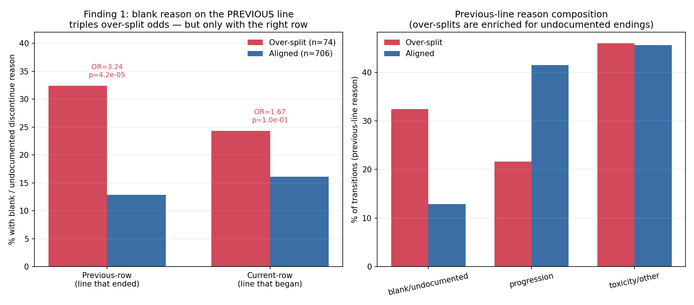
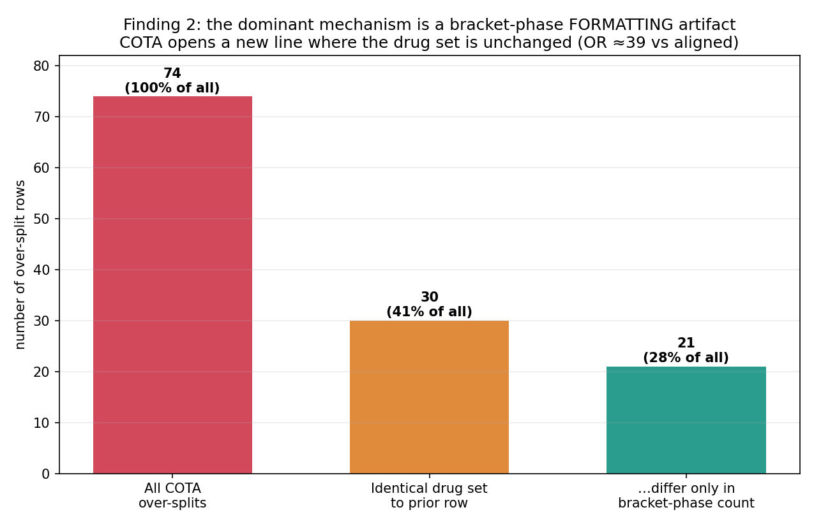
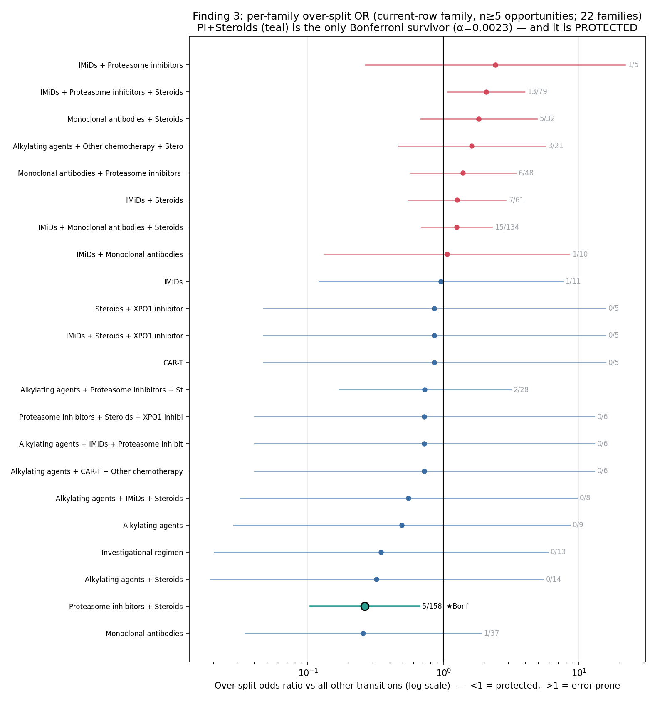
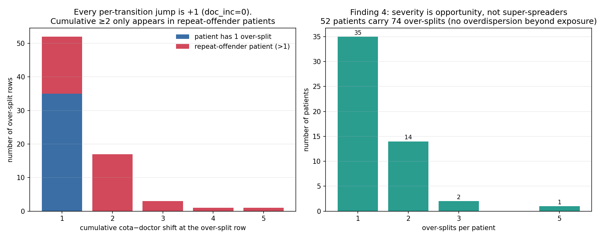
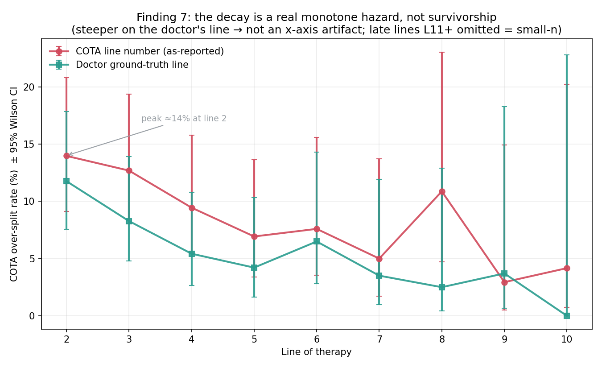

# COTA Line-of-Therapy Misclassification — Pattern-Hunt Summary

*Multiple myeloma · COTA cohort (136 patients, 780 line-transitions, 74 over-splits) · cross-checked on Flatiron (110 patients) · 2026-06-17*

---

## TL;DR

We searched for structure in the cases where the COTA vendor mis-counts lines of therapy (LOT), beyond what was already known. Three things are worth your attention:

1. **A new, actionable failure mode:** COTA over-splits **3.2× more often when the *previous* line ended with no documented reason** (OR 3.24, p=4×10⁻⁵). The signal only appears when the discontinuation reason is attributed to the line that *ended*, not the one that *began* — the earlier base-rate check used the wrong row.
2. **The dominant mechanism is a formatting artifact, not a clinical one:** **40% of over-splits** occur where the drug set is *identical* to the prior row (OR ≈ 39); 70% of those differ only in regimen-string bracket "phases." COTA's line logic is reacting to text formatting, not drug changes. **This replicates on Flatiron** (OR 23.6, p=5×10⁻⁵).
3. **Several intuitive hypotheses are wrong** — including the assumption that induction→maintenance "collapse to lenalidomide" drives errors (it's *protective*, and the maintenance agent is daratumumab). Documented below so they can be set aside.

Every error is COTA **over-counting** — it never under-counts in this cohort (74 over vs 0 under across 780 transitions), and that one-directionality turns out to be baked into how the data is structured.

---

## What "misclassification" means here

Each COTA row is one treatment line. We compare COTA's line count to a human reviewer's (the ground truth, Alpesh = Alberto = 100% agreement). A row is a **"candidate over-split"** when COTA started a new line but the reviewer did not. The dataset has 74 such over-splits against 706 aligned transitions (the control group used throughout).

**Method:** 13 independent hypotheses were each analyzed against the 706-transition control, then each finding was adversarially re-checked by a separate verifier (re-run the numbers, attack the confound, default to "refuted" if unconvinced). Only findings that survived are promoted below.

---

## Novel findings that survived verification

### 1. Over-splits follow an *undocumented prior-line ending* — clinical · high confidence

When the **previous** line ended with a blank `discontinue_reason`, COTA over-splits **32.4% (24/74)** of the time vs **12.9% (91/706)** otherwise — **OR 3.24 (95% CI 1.84–5.49), p=4.2×10⁻⁵**. Attributing the reason to the *current* row instead gives a null result (p≈0.1) — the attribution direction is itself the methodological catch. Line-independent, spans 21 patients, and largely *orthogonal* to the known drug-drop pattern (only 25% of these are de-escalations). **Interpretation:** COTA invents a line boundary where there is no coded clinical event to anchor it.

> *Caveat (informative missingness): a blank reason may reflect sparse documentation rather than a true absent event; the data can't separate "no event" from "uncoded event."*

### 2. The dominant mechanism is a bracket-phase *formatting* artifact — data-artifact · high confidence

In **30/74 (40.5%)** over-splits the parsed drug set is **identical** to the prior row, vs **12/706 (1.7%)** in controls — **OR 39.4, p=2×10⁻²⁴**. Of those 30, **21 differ only in the number of regimen-string bracket "phases"** (a maintenance/continuation phase appears or drops) with no actual drug change. COTA's line logic is triggered by regimen-string structure, not therapy change. This is the single highest-yield fix target.

### 3. PI + Steroid regimens are specifically *protected* — statistical · high confidence

Opportunity-normalized, proteasome-inhibitor + steroid regimens over-split at **4.2% vs 12.5%** elsewhere — **OR 0.31, p=1.1×10⁻⁴**, and it is the **only family combination of 36 that survives Bonferroni correction**. The effect is PI-specific (not a generic steroid-doublet effect) and survives line- and repeat-adjustment. **Interpretation:** the interesting family signal is a regimen COTA handles *well* — stable PI maintenance it correctly declines to re-line.

### 4. "Severe" over-counting is repeat-offender accumulation, never a big jump — data-artifact · high confidence

**Every one of the 74 over-splits is a single +1 step.** Cumulative gaps of +2…+5 arise purely from one patient accumulating several separate +1 over-splits (one patient supplies every +3/+4/+5). There is **no super-spreader clustering** beyond simple exposure (more transitions → more chances). This yields a clean corrected-count rule: *don't increment the line on a reviewer-hold row.*

---

## The decay curve, corrected

The over-split rate falls from ~14% at line 2 toward zero. We confirmed this is a **genuine declining hazard, not survivorship** (Spearman ρ=−0.80, p=0.01) — and **it is steeper on the reviewer's ground-truth line (OR 0.78) than on COTA's own line (OR 0.85)**, so it is not an x-axis artifact. The previously-described "quadratic U-shape" was a small-n tail artifact (3 events in risk sets of 2–4 at lines 14/16); the real shape is simply **monotone decreasing**.

---

## Cross-cohort check — Flatiron (110 patients)

Built directly from the raw Flatiron sheet (each row carries both a reviewer LoT and the Flatiron vendor LoT):

- **The over-split phenomenon generalizes.** Flatiron vendor over-splits **5.8% (35/605)** of transitions; it also **under-merges 7 times (1.2%)**.
- **Finding #2 replicates strongly** — identical drug set → over-split: **14.3% vs 0.7%, OR 23.6 (CI 6–92), p=5×10⁻⁵**.
- **The decay does *not* cleanly replicate** — Flatiron's rate is flatter and peaks at line 4 rather than line 2. Worth reporting as a real difference.
- **Finding #1 is untestable on Flatiron** — it has no `discontinue_reason` field.
- **Structural note:** COTA rows are indexed on the *vendor's* own lines, so only over-splits are observable (74 over / 0 under by construction). Flatiron rows are indexed on regimen entries, so **both** error directions are visible — which is why Flatiron, not COTA, exposes the 7 under-merge errors.

---

## What we ruled out (so they can be set aside)

- **Induction→maintenance "collapse to a single agent" does NOT drive errors — it's reversed.** Multi-drug→single-agent is *depleted* among over-splits (OR 0.25); staying multi-drug is *enriched*. The dominant maintenance single-agent is **daratumumab, not lenalidomide**.
- **The common "backbone" drugs (daratumumab, carfilzomib, bortezomib) are *less* likely to be the swing drug**, not more.
- **Steroid / dexamethasone churn — null.** Steroid-only changes are 2/74.
- **Line duration and inter-line time gaps — null.** Over-splits are not short fragments.
- **Patient-level "super-spreaders" — null** once you account for how many transitions each patient has.

---

## Methodological cautions

- **Small n.** 74 over-splits; many subgroups are single-digit. Treat p-values near 0.05 as fragile.
- **Multiple comparisons.** Across ~13 hypotheses, only **two** clear strict Bonferroni control: the identical-drug-set artifact and the PI+Steroid protection. Findings #1 and the decay are well below any reasonable threshold but are not Bonferroni-isolated.
- **Use the *reviewer's* line as the x-axis, not COTA's.** COTA's own (inflated) line number manufactures artifacts that vanish on ground truth; any future per-line analysis should default to the reviewer's count.
- **On the `Misclassification` label column** (in the updated dataset): it equals `(COTA line ≠ reviewer line)` exactly — i.e., a vendor-vs-reviewer disagreement flag, *not* the rule-based LOT algorithm's output (the algorithm and the vendor are different counts with different accuracies, 65% vs 61%).

---

## Implications for the labeling tool (confident / needs-review / not-seen-before)

The two strongest signals are computable **at deployment from a single row and its predecessor** — no vendor count, no ground truth required, which is exactly what a live tool has:

- **Needs doctor review** ← identical drug set / repeated regimen to the prior row (Finding 2), a blank/undocumented prior-line ending (Finding 1), a multi-drug reshuffle.
- **Confident** ← stable PI+Steroid continuation (Finding 3), a documented progression event, later lines.
- **Not seen before** ← out-of-distribution detection over the drug / family / regimen-structure vocabulary (a separate design choice, unaffected by these findings).

---

## Figures

All regenerable via `make_figures.py` (reads `COTA_misclassified_rows_UPD.xlsx`):

| File | Shows |
|---|---|
| `figs/fig1_decay_hazard.png` | Over-split rate by line, COTA-line vs reviewer-line, with Wilson CIs |
| `figs/fig2_discontinue_reason_flip.png` | The prior-row vs current-row attribution flip (Finding 1) |
| `figs/fig3_family_forest.png` | Per-family over-split odds ratios; PI+Steroids the lone Bonferroni survivor |
| `figs/fig4_identical_set_waterfall.png` | 74 → 30 identical-set → 21 bracket-phase-only (Finding 2) |
| `figs/fig5_severity_accumulation.png` | All jumps are +1; severity is repeat-offender accumulation (Finding 4) |

*Full analysis with every hypothesis and adversarial verdict: `FINDINGS_2026-06-17.md`.*
